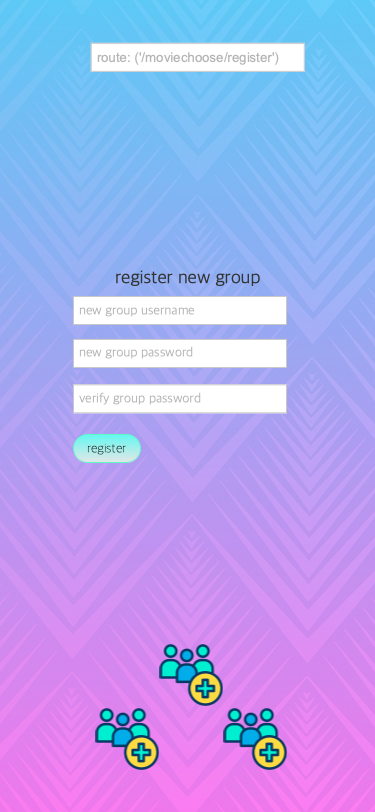
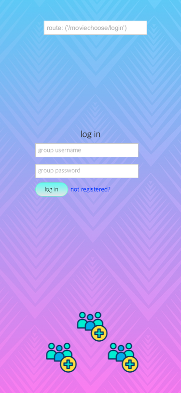
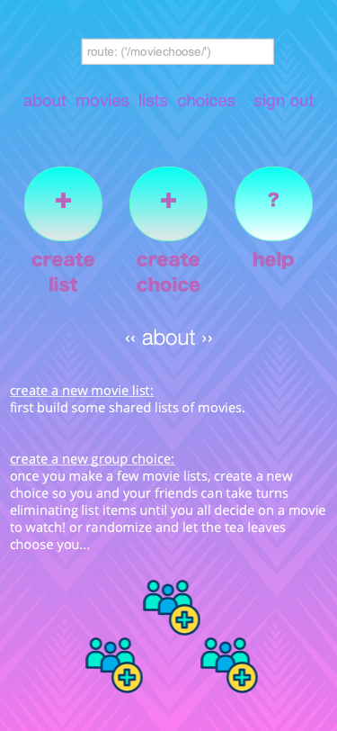
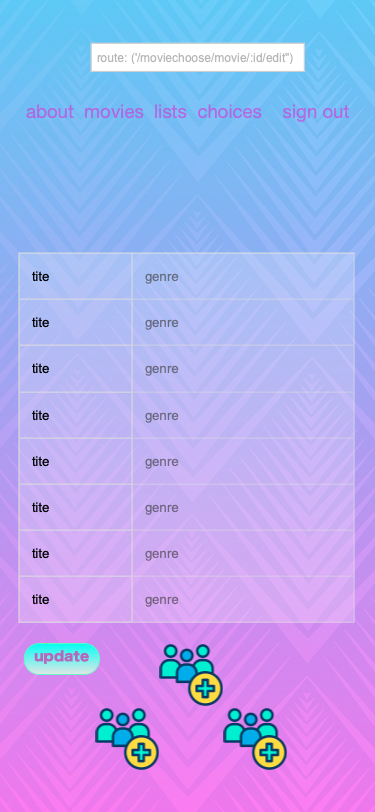
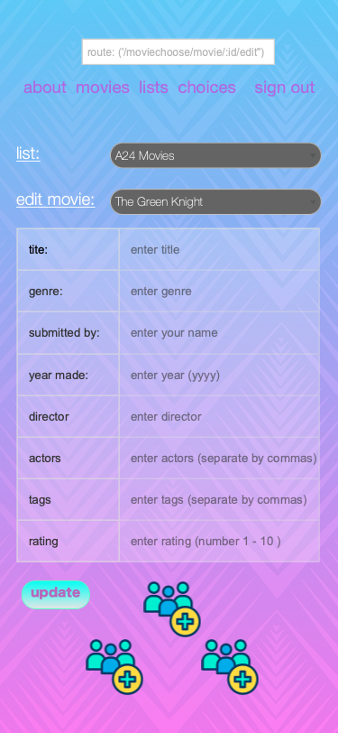
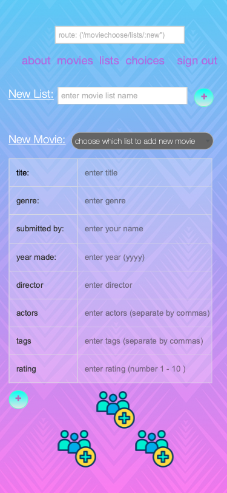
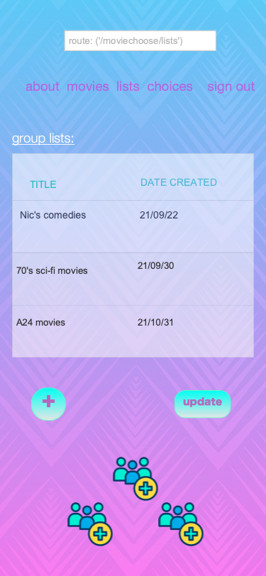
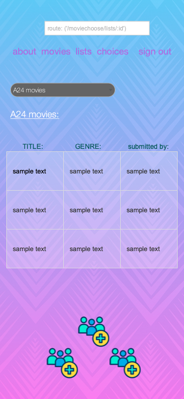

## PROJECT NAME
> **MOVIE CHOOSE**  
An app to help groups decide on which movie to watch

## PROJECT DESCRIPTION
> **Movie Choose** is a new way to help groups of people decide together on what to watch. 
   **Movie Choose** will allow friends to make lists of movies, then filter, delete and randomize choices based on group preferences.
  

## MODELS
**Movies** = {
    title: String,
    genre: String,
    submittedBy: String,
    yearMade: Num,
    director: String,
    actors: [String], 
    tags: [String],
    rating: Num
}
 
**Users** = {
    username: {
        type: String, 
        required: true,
        unique: true
    }, 
    password: {
        type: String, 
        required: true,
        unique: true
    }
}
 
**Lists** = {
    movies: [{ type: Schema.Types.ObjectId, ref: 'Movies' }],
    users: [{ type: Schema.Types.ObjectId, ref: 'User' }], 
}

## ROUTES
> register: (/users/register)  
> login: (/users/login)  
> about: (/about)  
#### CREATE
> movie lists NEW:(/lists/new)  
> movie lists POST:(/lists/)  
#### READ
> movie lists INDEX: (/lists/)  
> movie lists SHOW:(/lists/:id)  
> movies INDEX: (/movies/)  
#### UPDATE
> movies EDIT: (/movies/:id/edit)  
> movies UPDATE: (/movies/:id/)  
#### DELETE
> movies DELETE: (/movies/:id/)  
## STRETCH ROUTES
> group choices NEW: (/groupchoices/new)  
> group choices INDEX: (/groupchoices/)  
> group choices SHOW: (/groupchoices/:id)  

## WIREFRAMES
register:  
  
login:  
  
about:  
  
movies index:  
  
movies edit:  
  
movie list new:  
  
movie lists index:  
  
movie lists show:  
  

## USER STORIES
<ul>
<li> As a user, I want to be able to register and login with a shared group username/password combination.</li>
<li> As a user, I want to be able to be logged in on the same username, at the same time as my friends.</li>
<li> As a user, I want to be able to create new movie entries, new lists of these movies, and new choices for me and my friends to all contribute to.</li>
<li> As a user, I want to be able to delete entries singularly or by groups</li>
<li> As a user, I want to randomize remaining possible choices.</li>
</ul>

### MVP GOALS
<ul>
    <li> Build a full CRUD app with 7 RESTful routes.</li>
    <li> Build a full-stack application using Node.js, Mongoose, Express and EJS.</li>
    <li> Adhere to MVC methodologies.</li>
    <li> Deploy online via Heroku.</li>
</ul>

### STRETCH GOALS
<ul>
    <li> Full professional-quality styling</li>
    <li> Use a CSS framework</li>
    <li> Use EJS Partials</li>
    <li> Use a third party API</li>
</ul>
